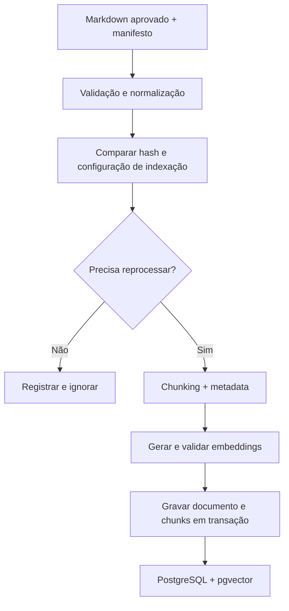
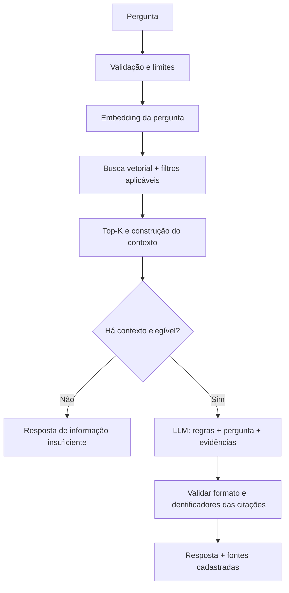

# Portfolio AI Assistant

Assistente de consulta sobre minha experiência profissional, projetos e decisões técnicas, com respostas fundamentadas em fontes públicas selecionadas.

O projeto tem como foco **RAG — Retrieval-Augmented Generation**: recuperar evidências de uma base de conhecimento própria e utilizá-las como contexto para um modelo de linguagem responder com fontes.

> **Status: estrutura inicial da indexação.** Há um núcleo de preparação de documentos e testes unitários. O pipeline RAG, os adapters externos e as Lambdas ainda não estão implementados. Não há deploy nem métricas de uso em produção.

## Problema e objetivo

Um visitante do portfólio precisa navegar por diferentes páginas e repositórios para encontrar informações específicas. O assistente deverá oferecer uma interface de consulta para perguntas como:

- Qual experiência está documentada com AWS?
- Quais projetos utilizam filas e por quê?
- Onde foram utilizados LLMs?
- Qual projeto demonstra tratamento de falhas?

O objetivo é implementar, publicar e operar uma aplicação RAG pequena, evoluindo sua qualidade, segurança e custo a partir de avaliações e utilização real.

O foco técnico é a recuperação de informações: ingestão, chunking, embeddings, busca vetorial, construção de contexto e fidelidade das respostas. O assistente será uma interface de consulta, sem executar ações externas no MVP.

## Comportamento esperado

- Responder com base nas evidências recuperadas e apresentar suas fontes.
- Não inventar experiências, tecnologias, resultados ou opiniões pessoais.
- Informar quando não encontrar evidência suficiente, sem confundir ausência de informação com ausência de experiência.
- Pedir esclarecimento quando a pergunta for ambígua.
- Distinguir falhas técnicas de perguntas sem resposta na base.
- Atender perguntas sobre o histórico profissional público, respeitando o escopo do produto.

Uma referência válida não garante que uma afirmação esteja correta: a fidelidade entre resposta e fonte também deverá ser avaliada.

## Escopo do MVP proposto

- Documentos Markdown revisados e explicitamente aprovados para publicação.
- Ingestão manual por uma CLI Python.
- Chunking por seções e parágrafos, preservando títulos e metadata.
- Embeddings por API, com modelo e dimensionalidade registrados.
- PostgreSQL + pgvector, inicialmente com busca vetorial exata por distância de cosseno.
- Seleção de contexto com limite de tokens e Top-K configurável.
- Geração de respostas com citações verificáveis.
- Consultas independentes, inicialmente pelo terminal e depois por FastAPI.
- Atualização por hash e substituição atômica dos chunks de documentos alterados.
- Testes automatizados, dataset de avaliação e métricas por etapa.

Modelo de embeddings, modelo de geração, tamanho dos chunks, overlap, Top-K e eventuais thresholds serão escolhidos ou ajustados por experimentos. Não são parâmetros validados neste momento.

## Arquitetura proposta

Os pipelines de ingestão e consulta terão responsabilidades separadas.

### Ingestão



Os novos embeddings deverão ser gerados antes da substituição dos chunks antigos. Uma falha durante o processamento deve preservar a versão anterior. Mudanças no modelo ou na configuração de chunking também podem exigir reindexação, mesmo quando o documento não mudou.

### Consulta



Documentos e consultas deverão utilizar o mesmo modelo e configuração de embeddings. Similaridade vetorial será tratada como sinal de relevância, não como probabilidade de uma resposta estar correta.

### Stack e implantação

| Componente | Proposta | Papel |
| --- | --- | --- |
| Linguagem | Python | Implementação dos pipelines |
| Banco local | PostgreSQL + pgvector em Docker | Persistência e busca vetorial reproduzíveis |
| Embeddings e geração | SDK direto do provedor, a definir | Integração explícita com modelos |
| API | FastAPI | Exposição do pipeline de consulta |
| Banco remoto | Neon, sujeito a validação | PostgreSQL gerenciado |
| Publicação | Duas AWS Lambdas com imagens Docker | Indexação administrativa separada da consulta com Function URL |
| Observabilidade | Logs estruturados; CloudWatch na AWS | Latência, erros, tokens e retrieval |
| CI/CD | GitHub Actions | Verificação e posterior deploy |

O primeiro objetivo é validar o pipeline local. Publicação pública dependerá de controles de abuso, limites de consumo, gestão de secrets e testes. LangChain, filas e orquestração adicional não fazem parte da proposta inicial.

## Base de conhecimento

Os [modelos de documentos e instruções](knowledge/README.md) já estão disponíveis.
O [inventário de exemplos](docs/examples.md) lista os modelos de cada projeto,
documentação técnica e avaliação, além das pendências de implementação.
O [manifesto inicial](knowledge/manifest.yaml) contém apenas entradas desabilitadas;
o loader ainda será implementado. `knowledge/` reúne fontes para o chatbot,
enquanto `docs/` documenta a engenharia do projeto e não é indexada automaticamente.

As primeiras fontes candidatas são:

1. Perfil profissional público, revisado e sem dados pessoais desnecessários.
2. Documentação pública do Melita, com contribuição, arquitetura e estado real de operação.
3. Descrição sanitizada da integração Salesforce com backend cloud.
4. Um caso documentado de automação com Python e AWS.
5. Documentação da plataforma SaaS de ensino de italiano.
6. Conteúdo selecionado do portfólio e READMEs públicos.

Essas fontes ainda precisam ser selecionadas e aprovadas. Estar disponível publicamente não implica inclusão automática.

Cada documento deverá identificar título, projeto, origem, URL pública quando disponível e versão ou data de atualização. Deve distinguir tecnologias utilizadas, contribuição pessoal, decisões técnicas e estado real: planejado, implementado, testado, publicado ou operado.

Credenciais, documentos privados, informações de clientes e conteúdo corporativo confidencial não devem integrar a base nem ser adicionados ao repositório.

## Modelagem inicial proposta

| Entidade | Responsabilidade |
| --- | --- |
| `documents` | Identidade estável da fonte, conteúdo normalizado, hash, origem, projeto e datas |
| `chunks` | Trechos, ordem, seção, vínculo com documento, embedding e metadata |
| `index_profiles` | Modelo, dimensionalidade e versões/configurações do processamento |
| `ingestion_runs` | Estado e métricas de cada execução de ingestão |

A versão inicial manterá uma versão ativa de cada documento. Identidade da fonte e hash do conteúdo serão conceitos separados. Índices aproximados, como HNSW, serão considerados somente se houver necessidade demonstrada por medições.

## Estrutura inicial implementada

```text
src/portfolio_ai/
    ingestion/
        models.py       # Fonte e documento preparado
        ports.py        # Contrato de leitura
        service.py      # Aprovação, leitura, normalização e hash
tests/unit/
    test_prepare_document.py
docs/adr/
    0001-ingestion-foundation.md
pyproject.toml
.env.example
.dockerignore
```

## Arquitetura de código e design patterns

A organização inicial é inspirada em **Ports and Adapters (arquitetura hexagonal)**,
aplicada de forma pequena: a lógica de preparação de documentos depende de um
contrato de leitura, e não de AWS, arquivos locais ou banco. Não é uma implementação
completa de todas as camadas de uma arquitetura hexagonal.

| Padrão ou técnica | Onde aparece | Por que utilizamos |
| --- | --- | --- |
| Service Layer | `ingestion/service.py`: `PrepareDocument` | Coordena aprovação, leitura, normalização e hash em um caso de uso |
| Port (contrato) | `ingestion/ports.py`: `DocumentLoader`, com `typing.Protocol` | Define a operação de leitura sem escolher sua implementação |
| Dependency Injection | `PrepareDocument(loader)` | Recebe a dependência pelo construtor, permitindo substituí-la nos testes |
| Objetos de dados imutáveis | `ingestion/models.py`: dataclasses com `frozen=True` | Representam a fonte e o documento preparado sem alterações acidentais |
| Test Double (stub) | `tests/unit/test_prepare_document.py`: `StubLoader` | Fornece texto fictício em memória para testar sem rede, AWS ou credenciais |

No fluxo já implementado, o teste fornece um `StubLoader` ao serviço, que o usa
através do contrato `DocumentLoader` e devolve um `PreparedDocument`.

O próximo adapter será o leitor de Markdown. Os handlers das duas Lambdas,
os clientes de embeddings e a persistência em pgvector ainda serão implementados.
Na Lambda, o ponto de entrada montará as dependências e chamará o serviço; as
regras de processamento permanecerão independentes do evento AWS.

Repository será considerado ao implementar a persistência. Não há container de
injeção de dependências, repository genérico ou hierarquia de classes criada por
antecipação. O layout `src/` é uma convenção de empacotamento Python, não um design pattern.

Leia a [decisão arquitetural](docs/adr/0001-ingestion-foundation.md) para conhecer
os trade-offs e limites desta estrutura.

## O que versionar em infra/

**A pasta `infra/` deve permanecer no Git.** Ela guardará definições reproduzíveis
da infraestrutura, como templates das Lambdas, permissões e configuração de deploy.
Atualmente contém apenas um roteiro de planejamento.

Credenciais e estado local não devem ser versionados. O `.gitignore` já exclui
`.env`, variantes de `.env`, diretórios de credenciais, `*.tfstate`, `*.tfstate.*`,
`*.tfvars`, `*.tfvars.json`, `.terraform/` e `.aws-sam/`, inclusive dentro de `infra/`.
Essas regras antecipam possíveis ferramentas; Terraform ainda não foi escolhido.

Os templates deverão referenciar secrets externos em vez de conter seus valores.
O `.env.example` permanece público com campos vazios. Ignorar arquivos por nome
não detecta secrets colocados dentro de arquivos versionáveis; revise o diff antes
de publicar.

## Estrutura prevista para evolução

Esta estrutura é uma proposta; os diretórios serão criados conforme cada etapa for implementada.

```text
src/portfolio_ai/
    api/
    ingestion/
    retrieval/
    providers/
    database/
    evaluation/
    models.py
    settings.py
    observability.py
knowledge/
    manifest.yaml
    documents/
migrations/
tests/
    unit/
    integration/
    security/
evals/
    datasets/
    reports/
docs/
    adr/
    experiments/
    architecture.md
    production-log.md
    runbook.md
infra/
.github/workflows/
compose.yaml
pyproject.toml
.env.example
```

## Avaliação e testes

A avaliação começará antes da geração de respostas, com perguntas e evidências esperadas anotadas a partir dos documentos aprovados.

| Dimensão | O que verificar |
| --- | --- |
| Retrieval | Documentos/trechos relevantes, Recall@K, MRR e cobertura das evidências |
| Geração | Fidelidade, completude, citações e abstenção adequada |
| Operação | Latência por etapa, erros, tokens e custo estimado |
| Segurança | Entradas inválidas, abuso, injeção direta e indireta |

O dataset deverá conter perguntas respondíveis, perguntas sem evidência, ambiguidades, paráfrases e casos que exigem mais de uma fonte. Evidências esperadas não serão inferidas apenas a partir de nomes de tecnologias ou projetos.

Testes unitários cobrirão lógica determinística, como parsing, hashing, chunking e construção do contexto. Testes de integração verificarão PostgreSQL, pgvector e os contratos da API. Avaliações com modelos reais serão separadas dos testes rápidos e não dependerão de respostas textuais idênticas.

## Segurança, privacidade e custos

Controles previstos para a exposição pública:

- Secrets fora do código e do contexto enviado ao modelo.
- Privilégios distintos para consulta e ingestão.
- SQL parametrizado, conexões TLS e validação de entrada.
- Limites de entrada, contexto, saída, duração, concorrência e consumo.
- Controle de abuso compartilhado entre instâncias; CORS não será considerado autenticação.
- Conteúdo recuperado tratado como dados não confiáveis, nunca como instruções.
- Fontes e URLs validadas pelo backend; renderização segura no frontend.
- Logs estruturados sem perguntas e respostas integrais por padrão.

Prompts restritivos e citações não eliminam alucinações nem prompt injection. Os controles deverão ser testados e suas limitações documentadas.

O custo incluirá embeddings de ingestão e consulta, tokens de geração, banco, API, execução, logs, secrets e transferência. A meta é manter baixo custo com pouco tráfego, sem presumir gratuidade. Estimativas numéricas dependerão dos modelos, preços e volumes definidos. Alarmes não substituem limites de consumo e uma opção de desligamento.

## Roadmap

- [ ] Revisar a arquitetura e aprovar o escopo inicial.
- [ ] Selecionar documentos públicos e construir o primeiro dataset de avaliação.
- [ ] Configurar Python, PostgreSQL + pgvector e testes locais.
- [ ] Implementar parsing, chunking e rastreabilidade das fontes.
- [ ] Gerar embeddings e avaliar a busca vetorial pelo terminal.
- [ ] Implementar geração com fontes e comportamento sem evidência suficiente.
- [ ] Validar atualização, exclusão e falhas de ingestão.
- [ ] Expor o pipeline por FastAPI.
- [ ] Preparar proteção contra abuso, observabilidade e CI/CD.
- [ ] Integrar ao portfólio e publicar.
- [ ] Registrar utilização, métricas, incidentes e melhorias reais.

Evoluções condicionadas a necessidades observadas: sincronização com GitHub, feedback de usuários, busca híbrida, reranking, cache, streaming e histórico de conversa.

## Como começar

O primeiro marco será **recuperar evidências corretas de três documentos aprovados para um conjunto de perguntas conhecidas**.

1. Selecionar um perfil profissional e dois projetos com conteúdo suficiente para responder perguntas concretas.
2. Revisar o que pode ser publicado e transformar o conteúdo em Markdown.
3. Escrever de 10 a 15 perguntas, indicando documento e trecho esperado; incluir casos sem resposta e ambiguidades.
4. Só então implementar normalização, chunking, embeddings e busca vetorial.
5. Inspecionar os resultados recuperados antes de adicionar geração por LLM.

## Desenvolvimento local

Requisito: Python 3.12 ou superior. Na raiz do repositório:

```bash
python3 -m venv .venv
source .venv/bin/activate
python -m pip install -e '.[dev]'
python -m pytest
python -m ruff check .
python -m ruff format --check .
```

Os testes atuais não exigem AWS, banco, API keys ou `.env`. O `.env.example`
contém somente nomes reservados para futuras integrações e valores vazios.

Arquivos `.env` e suas variantes, chaves privadas, credenciais locais e diretórios
`knowledge/raw/`, `knowledge/private/` e `data/` estão no `.gitignore`. O contexto
Docker usa uma lista de arquivos permitidos. Isso não detecta secrets inseridos
no código nem remove arquivos já rastreados: revise sempre o diff antes de publicar.

O próximo incremento será um loader Markdown com manifesto de fontes aprovadas,
seguido do chunking. O serviço atual prepara documentos; ainda não os indexa.

## Estado das evidências

Ainda não há demonstração, imagem Docker de aplicação ou deploy disponível.

O diário de produção será iniciado quando houver publicação real. Resultados de testes locais, publicação, utilização por terceiros e problemas observados em produção serão registrados separadamente. Nenhuma métrica ou experiência operacional será presumida a partir da conclusão do código.
