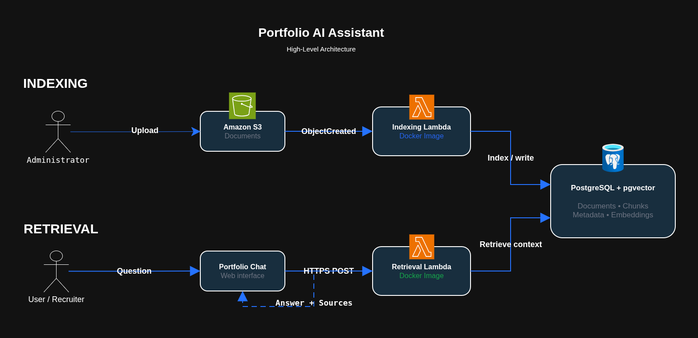

# Portfolio AI Assistant

Assistente RAG para consultar minha experiência profissional, projetos e decisões
técnicas por meio de um chat integrado ao portfólio. As respostas deverão utilizar
documentos públicos selecionados, apresentar fontes e reconhecer quando não houver
evidência suficiente.

**Em desenvolvimento.** O repositório contém handlers mínimos e definições Terraform
para duas Lambdas com empacotamento ZIP. O pipeline RAG e a migração para imagens
Docker ainda não foram implementados. Esta documentação descreve o código e a
arquitetura planejada; não comprova deploy ou operação em produção.

## Problema e objetivo

Informações profissionais estão distribuídas entre portfólio, currículo e
documentação de projetos. O assistente permitirá que visitantes e recrutadores
encontrem informações específicas sem precisar navegar por todas essas fontes.

Exemplos de perguntas:

- Qual experiência com AWS está documentada?
- Em quais projetos foram utilizadas filas?
- Por que determinada solução arquitetural foi escolhida?
- Qual projeto demonstra integração com LLMs?

O objetivo é construir e operar uma aplicação pequena, avaliar a qualidade da
recuperação e evoluir a partir de resultados medidos. O sistema não deverá inventar
experiência profissional nem executar ações externas em nome do visitante.

## Arquitetura alvo



[Abrir o diagrama em tamanho original](docs/diagrams/portfolio-ai-assistant-architecture.png).

O diagrama representa os dois fluxos principais planejados. As chamadas às APIs de
embeddings e geração, a Function URL, o ECR e os componentes de operação estão
descritos abaixo, mas não aparecem individualmente nesta visão de alto nível.

### Indexação

```text
Administrador → documentos aprovados em bucket S3 privado
→ evento ObjectCreated → Lambda de indexação
→ leitura e normalização → chunking + metadata
→ API de embeddings → PostgreSQL + pgvector
```

A indexação deverá preservar a origem dos trechos e registrar hash, versão e
configuração dos embeddings. Documentos alterados serão reprocessados, com
substituição atômica dos chunks após a geração dos novos embeddings.

O bucket não será público. Somente conteúdo autorizado para respostas públicas
deverá entrar na base. O mecanismo de aprovação ainda será implementado.

### Consulta

```text
Visitante → chat do portfólio → HTTPS / Lambda Function URL
→ validação → embedding da pergunta → busca no pgvector
→ seleção de contexto → API de LLM → resposta com fontes
```

A Lambda de consulta coordenará retrieval e geração. Documentos e perguntas
deverão usar a mesma configuração de embeddings. Sem evidência suficiente, o
assistente deverá informar a limitação; falhas técnicas terão tratamento próprio.

A busca inicial planejada é exata, por distância de cosseno. Chunking, Top-K e
eventuais thresholds serão avaliados com perguntas e evidências conhecidas.
Similaridade não será interpretada como garantia de verdade.

### Infraestrutura prevista

- Duas Lambdas independentes, com imagens Docker armazenadas no Amazon ECR.
- S3 para documentos e notificação de criação de objetos para a indexação.
- Function URL para consultas do portfólio; indexação sem endpoint público.
- PostgreSQL + pgvector; Neon permanece como candidato de hospedagem.
- Terraform para recursos AWS e roles IAM separadas.
- CloudWatch para logs e métricas.
- GitHub Actions para testes, build e deploy em uma etapa posterior.

Provedores/modelos de embeddings e geração ainda serão escolhidos.

## Estado atual do repositório

| Componente | Situação no código |
| --- | --- |
| Terraform | Providers AWS/archive, backend S3 e região configurados |
| Lambdas | Duas funções definidas com runtime Python 3.14 e pacote ZIP |
| IAM | Roles separadas com política de confiança para Lambda; permissões operacionais pendentes |
| Handlers utilizados pelo Terraform | Retornam mensagem fixa; não executam RAG |
| Entrada S3 | Arquivo reservado, ainda levanta `NotImplementedError` |
| Dockerfiles | Orientações de implementação; ainda não são buildáveis |
| ECR, S3 de documentos e notificação | Arquivos reservados, sem recursos implementados |
| Function URL | Ainda não definida no Terraform |
| Embeddings, retrieval, geração e persistência | Módulos reservados |
| Testes | Configuração pytest e exemplos de eventos; sem testes coletáveis |
| Scripts de invocação | Ainda não implementados |

O backend S3 do Terraform armazena **estado da infraestrutura**. Ele é distinto
do futuro bucket de documentos do RAG.

## Organização do código

```text
portfolio-ai-assistant/
├── src/
│   ├── interfaces/
│   │   ├── http/
│   │   │   ├── indexing/lambda_function.py
│   │   │   └── retrieval/lambda_function.py
│   │   └── events/s3_handler.py
│   ├── ingestion/          # Leitura e chunking
│   ├── embeddings/         # Vetorização de documentos e perguntas
│   ├── retrieval/          # Busca e seleção de contexto
│   ├── generation/         # Respostas fundamentadas
│   └── persistence/        # Operações PostgreSQL + pgvector
├── tests/
│   ├── unit/              # Pastas por módulo, ainda sem testes
│   └── events/            # Exemplos S3 e HTTP
├── scripts/               # Invocação das funções
├── docker/                # Dockerfiles de indexação e consulta
├── terraform/             # Recursos e configuração AWS
├── docs/diagrams/         # Diagrama de arquitetura
├── requirements.txt
├── pytest.ini
├── Makefile
└── README.md
```

A organização separa interfaces de entrada, processamento e persistência. Os
handlers deverão traduzir eventos e chamar serviços; clientes externos serão
injetados quando necessário para permitir testes sem AWS ou chamadas pagas.

Atualmente, o Terraform empacota as entradas de `interfaces/http/indexing/` e
`interfaces/http/retrieval/`. O nome da pasta não cria um endpoint HTTP. A futura
indexação por S3 deverá ser conectada a `interfaces/events/s3_handler.py`, e as
entradas configuradas nas imagens serão alinhadas durante a migração para Docker.

## Desenvolvimento local

Criar um ambiente virtual e instalar as dependências de desenvolvimento:

```bash
python3 -m venv .venv
source .venv/bin/activate
make install-dev
```

O alvo instala `requirements.txt` e pytest. Ainda não há dependências de runtime
para os provedores de modelos ou banco.

Quando os testes forem implementados:

```bash
make test
```

No estado atual, o pytest não encontra testes e retorna código 5. Os JSONs em
`tests/events/` são dados de exemplo, não testes executáveis.

O evento de consulta representa o envelope entregue pela Function URL. Em uma
requisição HTTP real, o cliente enviará apenas o JSON da pergunta presente em
`body`, não o envelope inteiro.

## Terraform e deploy

A configuração atual em `terraform/providers.tf` referencia um backend S3
específico do projeto. Para utilizá-la em outra conta, revisar backend, região,
credenciais externas e nomes antes de inicializar.

O Terraform atual cria pacotes ZIP dos handlers mínimos. Esses pacotes ainda não
incluem um pipeline RAG. A publicação de imagens no ECR, a configuração das Lambdas
para usá-las e os procedimentos de deploy/rollback serão implementados depois.

Nenhum comando de aplicação de infraestrutura foi executado para esta revisão
do README. A existência de recursos definidos no código não confirma seu estado
na AWS.

## Segurança e operação

Antes de disponibilizar o chat publicamente, implementar:

- Seleção explícita de fontes, sem credenciais ou dados confidenciais.
- Secrets externos ao código, às imagens e ao contexto do modelo.
- Permissões mínimas e distintas para indexação e consulta.
- Limites de entrada, contexto, saída, duração e consumo.
- Tratamento de erros e logs estruturados sem exposição desnecessária de conteúdo.
- Validação das citações e renderização segura no frontend.
- Testes de prompt injection direta e indireta.

Conteúdo recuperado deve ser tratado como dado, não como instrução. Prompts
restritivos e citações não eliminam alucinações ou prompt injection.
As exclusões do Git e do contexto Docker não substituem a revisão dos arquivos
antes de publicá-los.

## Avaliação e próximos passos

1. Validar a infraestrutura mínima e completar permissões de logs.
2. Implementar ECR e imagens Docker; alinhar os handlers e o Terraform.
3. Selecionar poucos documentos e anotar perguntas com evidências esperadas.
4. Implementar leitura, chunking, embeddings e persistência com testes.
5. Conectar a indexação ao S3 e validar atualização/exclusão de documentos.
6. Implementar consulta, Function URL e integração com o portfólio.
7. Avaliar retrieval separadamente da geração.
8. Medir latência, erros, tokens e custos antes de otimizar.

Implementação, testes locais, publicação e operação serão registrados como etapas
distintas. Não há métricas de uso ou incidentes de produção documentados.
