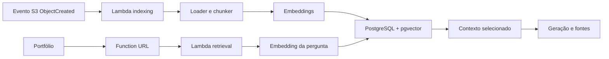

# Fluxos previstos

Os diagramas descrevem o objetivo, não funcionalidades já disponíveis.

```mermaid
flowchart LR
    A[Evento S3 ObjectCreated] --> B[Lambda indexing]
    B --> C[Loader e chunker]
    C --> D[Embeddings]
    D --> E[PostgreSQL + pgvector]
    F[Portfólio] --> G[Function URL]
    G --> H[Lambda retrieval]
    H --> I[Embedding da pergunta]
    I --> E
    E --> J[Contexto selecionado]
    J --> K[Geração e fontes]
```
